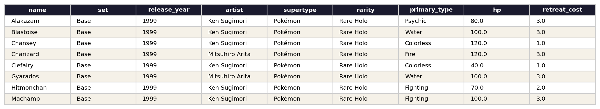
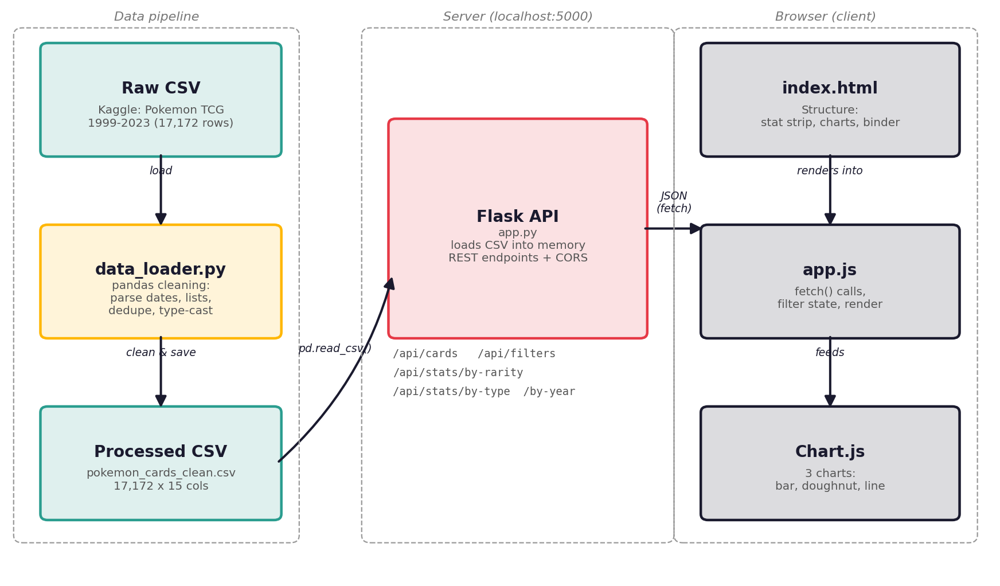

# Pokémon TCG Card Explorer

A dashboard for browsing and analysing the Pokémon Trading Card Game catalog from 1999 to 2023 — search and filter 17,000+ cards, and explore rarity, type, and printing-volume trends over 25 years of sets.

Built as a three-tier project: a pandas data-cleaning pipeline, a Flask REST API, and a vanilla HTML/CSS/JS client with Chart.js visualisations.

---

## 1. Objectives

- Provide a searchable, filterable catalog of Pokémon TCG cards (name, set, series, rarity, type, HP, artist, release date).
- Surface catalog-level trends: which rarities are most common, how card types are distributed, how print volume has grown year over year.
- Demonstrate a clean data → API → UI pipeline: raw CSV → pandas cleaning → Flask REST endpoints → JSON → client-side charts and filtering.

## 2. Dataset

**Source:** [Pokémon TCG All Cards 1999–2023](https://www.kaggle.com/datasets/adampq/pokemon-tcg-all-cards-1999-2023) (Kaggle), built from the official Pokémon TCG API.

| | |
|---|---|
| Raw rows | 17,172 |
| Raw columns | 29 |
| Processed columns used | 15 |
| Date range | 1999-01-09 to 2023 |
| Sets | 156 |
| Series | 16 |

**Note:** this dataset contains card *attributes* (name, set, rarity, type, HP, artist, release date), not pricing data. An earlier plan to merge in a PriceCharting historic-pricing dataset was dropped after discovering it has no shared key (name/set) with any freely available card-attribute dataset — see "Data decisions" below.

Sample of the cleaned data:



### Data decisions

- Dropped 14 deeply-nested columns not needed for this use case (`abilities`, `attacks`, `legalities`, `ancientTrait`, etc.) to keep the processed file lean and flat.
- `types` and `subtypes` are stored in the raw CSV as stringified Python lists (e.g. `"['Fire', 'Flying']"`) — parsed with `ast.literal_eval` into a `primary_type` (first type) and `types_display` (comma-joined) column, since the game's multi-typing is rare and a scalar field is more useful for filtering/charting.
- `hp` and `retreat_cost` are legitimately null for Trainer and Energy cards (they don't have HP). These are left as `null` rather than imputed to 0, since 0 would misleadingly read as "a Pokémon with 0 HP." The API converts `NaN` to JSON `null`.
- Rows missing `name`, `set`, or an unparseable `release_date` are dropped (0 rows were affected — the source data was already clean).
- Deduplicated on the card `id` (0 duplicates found).

Full pipeline: [`server/data_loader.py`](server/data_loader.py).

## 3. Architecture



```
pokemon-tcg-dashboard/
├── data/
│   ├── raw/pokemon_cards_raw.csv          # original Kaggle CSV
│   └── processed/pokemon_cards_clean.csv  # cleaned output (generated)
├── server/
│   ├── app.py            # Flask app: REST endpoints, filtering, pagination
│   ├── data_loader.py     # pandas cleaning pipeline
│   └── requirements.txt
├── client/
│   ├── index.html
│   ├── styles.css
│   └── app.js             # fetch calls, Chart.js, filter/pagination state
├── docs/                  # README images
├── .gitignore
└── README.md
```

**Data flow:** raw CSV → `data_loader.py` (pandas: parse, clean, dedupe) → processed CSV → loaded into memory by `app.py` at Flask startup → served as JSON over REST endpoints (with filtering, sorting, pagination) → fetched by `app.js` → rendered into the stat strip, Chart.js visualisations, and the card grid.

## 4. API reference

Base URL: `http://127.0.0.1:5000/api`

| Endpoint | Description |
|---|---|
| `GET /health` | Server status + row count |
| `GET /filters` | Distinct values for every filterable field (for populating dropdowns) |
| `GET /cards` | Paginated card list. See query params below |
| `GET /cards/<id>` | Single card detail |
| `GET /stats/overview` | Headline numbers (total cards, sets, series, artists, avg HP) |
| `GET /stats/by-rarity` | Card count + avg HP grouped by rarity |
| `GET /stats/by-type` | Card count + avg HP grouped by primary type |
| `GET /stats/by-set` | Card count + avg HP grouped by set (most recent N, default 20) |
| `GET /stats/by-year` | Card count grouped by release year |

**`/cards` query parameters** (all optional, chainable):

| Param | Type | Example |
|---|---|---|
| `q` | string, substring match on name | `q=charizard` |
| `set` | exact match | `set=Base` |
| `series` | exact match | `series=Sword & Shield` |
| `rarity` | exact match | `rarity=Rare Holo` |
| `type` | exact match on primary type | `type=Fire` |
| `supertype` | Pokémon / Trainer / Energy | `supertype=Pokémon` |
| `year_from`, `year_to` | int | `year_from=2015&year_to=2020` |
| `hp_min`, `hp_max` | float | `hp_min=100` |
| `sort_by` | column name | `sort_by=hp` |
| `order` | `asc` \| `desc` | `order=desc` |
| `page`, `page_size` | int (page_size max 200) | `page=2&page_size=25` |

Example: `GET /api/cards?set=Base&rarity=Rare Holo&sort_by=hp&order=desc&page_size=10`

Errors return JSON (`{"error": "..."}`) with `400` for invalid input (e.g. bad `sort_by`) and `404` for a missing card.

## 5. Running locally

### Prerequisites
- Python 3.9+
- A modern browser

### Steps

```bash
# 1. Clone and enter the project
git clone <your-repo-url>
cd pokemon-tcg-dashboard

# 2. Set up the server
cd server
pip install -r requirements.txt

# 3. Generate the cleaned dataset (only needed once, or after changing data_loader.py)
python data_loader.py

# 4. Start the Flask API (runs on http://127.0.0.1:5000)
python app.py
```

Leave that terminal running, then in a **second terminal**:

```bash
# 5. Serve the client
cd pokemon-tcg-dashboard/client
python -m http.server 8000
```

Open **http://127.0.0.1:8000** in your browser. The client talks to the API at `http://127.0.0.1:5000` (CORS is enabled server-side, so this cross-port setup works locally).

> You can also just double-click `client/index.html` to open it directly (`file://`) — modern browsers still allow the `fetch()` calls to `127.0.0.1:5000` in this case, but serving it via `http.server` is recommended for consistent behaviour.

## 6. Features

- **Stat strip** — headline counts (total cards, sets, series, artists, year range, average HP).
- **Three charts** (Chart.js): horizontal bar of card count by rarity, doughnut of card count by energy type, line chart of cards printed per year.
- **Filterable, searchable card browser** — search by name, filter by card type, series, set, rarity, energy type, and release-year range, all chainable. Sort by name, release date, HP, set, or rarity, ascending or descending.
- **Pagination** with page indicator and prev/next controls.
- **Loading skeletons**, an empty-state message with a "clear filters" action, and an error state if the API is unreachable.
- Fully responsive down to mobile widths.

## 7. Deployment

For a public link, the simplest options are:

- **Client:** deploy the `client/` folder as a static site on Vercel or Netlify.
- **Server:** deploy `server/` to Render (or Railway/Fly.io) as a Python web service, or expose a local Flask instance quickly for testing with `ngrok http 5000`.

If deploying the client and server to different origins, update `API_BASE` at the top of `client/app.js` to point to the deployed server's URL.

## 8. Tech stack

- **Data:** pandas
- **Server:** Flask, Flask-CORS
- **Client:** HTML, CSS, vanilla JavaScript, Chart.js (via CDN)